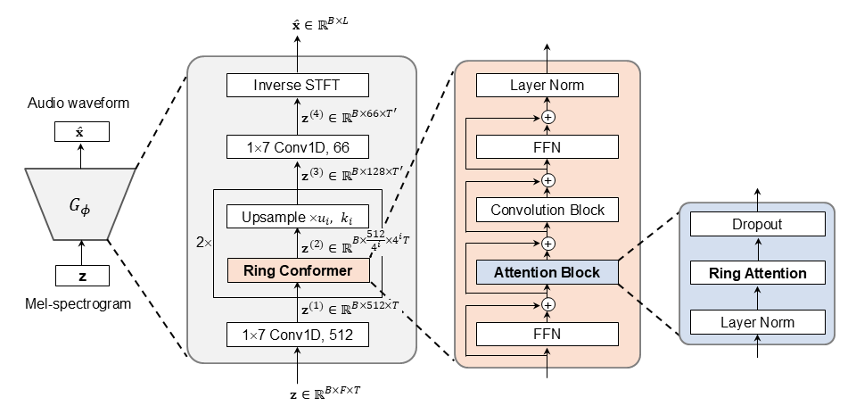

<table>
    <tr>
        <td>
            <p align="center">
                <br>
                <b>RingFormer Architecture</b>
            </p>
        </td>
    </tr>
</table>

## RingFormer: A Neural Vocoder with Ring Attention and Convolution-Augmented Transformer

#### Seongho Hong, Yong-Hoon Choi

[[Paper]](https://arxiv.org/abs/2501.01182) - [[Code]](https://github.com/seongho608/RingFormer) - [[Demo]](https://seongho608.github.io/)

## Getting Started

### Dependencies
You can install the Python dependencies with
```
pip install -r requirements.txt
```

#### Datasets

The supported dataset is

- [LJSpeech](https://keithito.com/LJ-Speech-Dataset/): The LJSpeech Dataset consists of speech data recorded by a single English speaker (single-speaker TTS) with an American accent. The dataset contains approximately 13,100 audio clips, each corresponding to a short passage from classic literature and other public domain texts. The total audio duration is around 24 hours, making it well-suited for training text-to-speech models.

### Training

Train with

```
python train.py -c configs/vits2_ljs_ring.json -m "model name"
```

### TensorBoard

Use
```
tensorboard --logdir ./logs/
```
to serve TensorBoard on your localhost.
The loss curves, synthesized mel-spectrograms, and audios are shown.

### Inference
```
python inference.py --text "your text to synthesize" --output "output.wav"
```

## References
### Codes
- [p0p4k's VITS2](https://github.com/p0p4k/vits2_pytorch)
- [lucidrains' Conformer](https://github.com/lucidrains/conformer)
- [lucidrains' Ring Attention](https://github.com/lucidrains/ring-attention-pytorch) 
### Papers
- [VITS2: Improving Quality and Efficiency of Single-Stage Text-to-Speech with Adversarial Learning and Architecture Design](https://arxiv.org/abs/2307.16430)
- [Conformer: Convolution-augmented Transformer for Speech Recognition](https://arxiv.org/abs/2005.08100)
- [Ring Attention with Blockwise Transformers for Near-Infinite Context](https://arxiv.org/abs/2310.01889)
### Datasets
- [LJ Speech](https://keithito.com/LJ-Speech-Dataset/)
